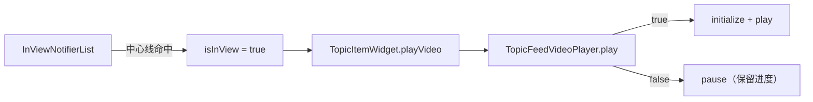

# 动态列表内嵌视频播放

本文说明 Topic 列表里「滚到中间自动播、滚走暂停、回到原进度」的实现方式，并整理相关问答，便于后续理解与改动。

## 相关文件

| 文件 | 职责 |
|------|------|
| `presentation/topic_list_base_state.dart` | 列表可视区判定；把 `isInView` 传给 item |
| `presentation/widgets/topic_item_widget.dart` | 接收 `playVideo`，转给播放器 |
| `presentation/widgets/topic_feed_video_player.dart` | 懒创建 `VideoPlayerController`、播/暂停、UI |
| `presentation/topic_detail_page.dart` | 详情页复用同一播放器，`play: true` 常播 |

依赖：

- `inview_notifier_list`：滚动时判断哪个 item 在视口「有效区域」
- `video_player`：跨平台播放器；**Android 底层是 ExoPlayer**

## 整体链路

```text
InViewNotifierList / InViewNotifierCustomScrollView
        │
        │  自定义条件：item 是否包住视口垂直中线
        ▼
InViewNotifierWidget(id: video-{tid})
        │
        │  isInView
        ▼
TopicItemWidget(playVideo: isInView)
        │
        ▼
TopicFeedVideoPlayer(play: playVideo)
        │
        ├─ play == true  → 懒创建 Controller → play()
        └─ play == false → pause()（不销毁，进度留在 Controller 里）
```



## 可视区怎么判定

列表使用 `InViewNotifierList`（无 header）或 `InViewNotifierCustomScrollView`（有 header）。

命中条件 `_isCenterInView`：item 的上下边界包住视口**垂直中线**。同一时刻通常只有一条动态满足，因此同时自动播放的视频基本只有一个。

```dart
// topic_list_base_state.dart
bool _isCenterInView(
  double deltaTop,
  double deltaBottom,
  double viewPortDimension,
) {
  return deltaTop < (0.5 * viewPortDimension) &&
      deltaBottom > (0.5 * viewPortDimension);
}
```

有视频的 item 包一层 `InViewNotifierWidget`，id 为 `video-{tid}`：

```dart
InViewNotifierWidget(
  id: _videoInViewId(topicModel),
  builder: (context, isInView, _) {
    return TopicItemWidget(
      topicModel: topicModel,
      listener: this,
      playVideo: isInView,
    );
  },
)
```

首屏用 `initialInViewIds` 预选列表里**第一条带视频**的动态，避免刚进页还要先滚一下才播。

播放器侧：`setVolume(0)` 静音、`setLooping(true)` 循环；无播控按钮，仅底部细进度条 + 右下角倒计时。展示尺寸与单图网格一致。

---

## 问答整理

### Q1：怎么记住最后播放时间点的？

**没有单独维护一份「进度缓存 Map」。**

滚出有效区时只调用 `controller.pause()`，不 `seek`、也不立刻 `dispose`。进度留在还活着的 `VideoPlayerController`（底层 ExoPlayer）内部。再次 `play == true` 时从暂停点继续。

```dart
// topic_feed_video_player.dart — _syncPlayState
if (widget.play) {
  if (!controller.value.isPlaying) {
    controller.play();
  }
} else if (controller.value.isPlaying) {
  controller.pause();
}
```

**局限：** 列表把 item 回收、`State.dispose()` 后会释放 Controller，**进度丢失**，下次再进有效区会从头播。当前实现没有跨销毁的持久化。

### Q2：一共有几个 ExoPlayer 在跑？

分两种「数量」：

| 状态 | 数量 |
|------|------|
| 正在播（`isPlaying`） | 通常最多 **1** 个（中线命中条件） |
| 已创建、可能处于 pause 的实例 | 视口 + ListView cache 里「曾经播过且尚未 dispose」的视频 item 数 |

Controller **懒创建**：只有 `play == true` 时才 `VideoPlayerController.networkUrl(...)`。从未进过自动播放区的视频 item **不会**创建播放器。

### Q3：视频 item 滚出去的时候怎么停止播放的？

两段式：

1. **离开中线，但仍在列表缓存内**  
   `isInView` → `false` → `playVideo` / `play` → `false` → `didUpdateWidget` → `_syncPlayState()` → `pause()`。  
   ExoPlayer 还在，只是停住，所以能记住进度。

2. **滚得足够远，ListView 回收该 item**  
   `dispose` → `_disposeController()`，真正销毁底层 ExoPlayer，进度一并丢掉。

### Q4：是不是每个 item 都有一个独立的 ExoPlayer，只是 playing 的只有一个？

**不完全是。**

更准确的说法：

- **不是**每个视频 item 一上来就有一个 ExoPlayer。
- 只有曾经 `play == true`（进过中线并开始播）的 item 才会创建自己的 `VideoPlayerController`（Android 上对应一个 ExoPlayer）。
- 滚出去但还没被 ListView 回收时：这个 ExoPlayer **还在，只是 pause**。
- 真正 **playing 的通常只有 1 个**。
- 从没进过播放区的、或已被 dispose 的 item：**没有** ExoPlayer。

一句话：  
「每个**播过且还活着**的视频 item 各有一个独立 ExoPlayer，同时在播的最多一个」；  
不是「列表里每个 item 都常驻一个」。

---

## 行为小结

| 场景 | 行为 |
|------|------|
| item 中线进入视口中线 | 懒创建（如需）并 `play()` |
| item 中线离开视口中线 | `pause()`，进度保留在 Controller |
| item 被 ListView dispose | 销毁 Controller / ExoPlayer，进度清零 |
| 从未自动播放过的视频 item | 无 Controller，只显示封面 |
| 详情页 | 同一组件，`play: true`，进入即播 |
