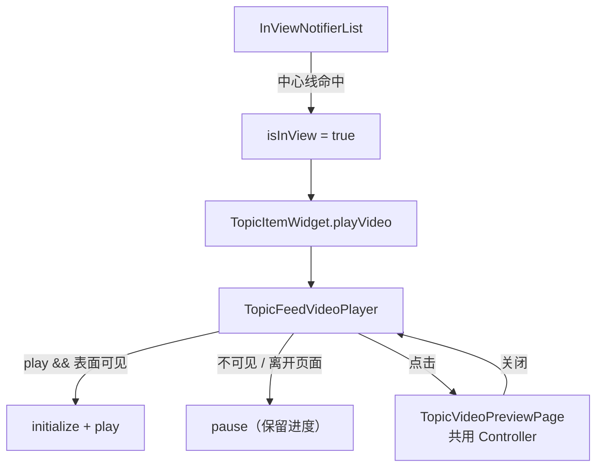

# 动态列表内嵌视频播放

本文说明 Topic 列表里「滚到中间自动播、滚走暂停、回到原进度」的实现方式，以及后续补上的**全屏放大预览**、**离开页面暂停**、**个人主页复用列表**等能力，并整理相关问答，便于后续理解与改动。

## 相关文件

| 文件 | 职责 |
|------|------|
| `presentation/topic_list_base_state.dart` | 列表可视区判定；`buildTopicListItem` / `buildTopicListView`；从详情返回时 `resumeNonce++` |
| `presentation/widgets/topic_item_widget.dart` | 接收 `playVideo` / `videoResumeNonce`，转给播放器 |
| `presentation/widgets/topic_feed_video_player.dart` | 懒创建 Controller、播/暂停、离开表面暂停、点击打开放大预览 |
| `presentation/widgets/topic_video_preview_page.dart` | 全屏放大预览：共用列表 Controller、进度条、保存相册 |
| `presentation/topic_detail_page.dart` | 详情页复用同一播放器，`play: true` 常播 |
| `presentation/user_detail_page.dart` | 个人主页：`buildListHeader` + `buildTopicListView`，与首页同一套 InView / 播放逻辑 |

依赖：

- `inview_notifier_list`：滚动时判断哪个 item 在视口「有效区域」
- `video_player`：跨平台播放器；**Android 底层是 ExoPlayer**
- `dismissible_page` / `gal`：放大页下滑关闭、保存到相册
- `go_router`：监听路由变化（切 Tab / 进二级页）以暂停列表视频

## 整体链路

```text
InViewNotifierList / InViewNotifierCustomScrollView
        │
        │  自定义条件：item 是否包住视口垂直中线
        ▼
InViewNotifierWidget(id: video-{tid})
        │
        │  isInView
        ▼
TopicItemWidget(playVideo: isInView, videoResumeNonce: …)
        │
        ▼
TopicFeedVideoPlayer(play, resumeNonce)
        │
        ├─ play && 表面可见 → 懒创建 Controller → play()
        ├─ 否则 → pause()（不销毁，进度留在 Controller 里）
        │
        └─ 点击 → 移交同一 Controller → TopicVideoPreviewPage（有声全屏）
                      └─ 关闭 → 收回 Controller，列表静音续播
```



## 可视区怎么判定

列表使用 `InViewNotifierList`（无 header）或 `InViewNotifierCustomScrollView`（有 header，如个人主页）。

命中条件 `_isCenterInView`：item 的上下边界包住视口**垂直中线**。同一时刻通常只有一条动态满足，因此同时自动播放的视频基本只有一个。

```dart
// topic_list_base_state.dart
bool _isCenterInView(
  double deltaTop,
  double deltaBottom,
  double viewPortDimension,
) {
  return deltaTop < (0.5 * viewPortDimension) &&
      deltaBottom > (0.5 * viewPortDimension);
}
```

有视频的 item 包一层 `InViewNotifierWidget`，id 为 `video-{tid}`，经 `buildTopicListItem` 统一构建（首页与个人主页共用）：

```dart
InViewNotifierWidget(
  id: _videoInViewId(topicModel),
  builder: (context, isInView, _) {
    return TopicItemWidget(
      topicModel: topicModel,
      listener: this,
      playVideo: isInView,
      videoResumeNonce: _videoResumeNonce,
    );
  },
)
```

首屏用 `initialInViewIds` 预选列表里**第一条带视频**的动态，避免刚进页还要先滚一下才播。

播放器侧（列表内嵌）：`setVolume(0)` 静音、`setLooping(true)` 循环；无播控按钮，仅底部细进度条 + 右下角倒计时。展示尺寸与单图网格一致。

---

## 全屏放大预览（共用 Controller）

目标：列表播到第 10 秒 → 点开放大从第 10 秒继续 → 再播几秒关掉 → 列表从最新进度接着播，且尽量不重新 loading。

### 做法：方案 A（移交同一个 `VideoPlayerController`）

| 步骤 | 行为 |
|------|------|
| 打开前 | 列表先卸下 `VideoPlayer`（改显示封面），避免同一 Controller 双挂载 |
| 打开 | `TopicVideoControllerHandoff` 把 Controller 交给预览页；预览页 `setVolume(1)` |
| 预览中 | 单击画面暂停/播放；底部可拖进度条；上下滑关闭；长按保存相册 |
| 关闭后 | Controller 还给列表；`setVolume(0)`；按当前 `play` / 表面可见性续播 |

预览打开期间列表侧 `_isPreviewOpen == true`：不响应 `play` / 路由带来的 pause，避免打断全屏。

若预览打开时列表 item 被 dispose，handoff 标记 `listDisposed`，由预览页关闭时负责 `dispose` Controller。

### 预览页能力（当前范围）

- 要：播放/暂停、拖进度、上下滑关闭、保存相册  
- 不要：全屏横屏、倍速、图+视频混滑

---

## 离开页面必须暂停

产品规则：**离开列表「表面」就停**（省流量 / 解码），但**放大全屏除外**（仍共用进度）。

| 场景 | 是否暂停 | 实现要点 |
|------|----------|----------|
| 滚出中线 | 是 | `play: false` → `_syncPlayState` |
| 切底部 Tab | 是 | 监听 `GoRouter.routerDelegate`；Shell 内仅 `matchedLocation == /topic` 才算可见 |
| push 二级页（详情、个人主页等） | 是 | `TickerMode` 被关掉 + 路由监听；Shell 内 location 不再是 `/topic` |
| 个人主页再进三级页 | 是 | 个人主页在 root 栈上，靠 `TickerMode`（无 Shell 祖先） |
| 放大全屏预览 | **否** | `_isPreviewOpen` 短路，不 pause |
| 从详情 pop 回列表 | 续播 | `resumeNonce++` 强制再 `_syncPlayState`（因 `play` 可能一直为 true） |

### 为什么要 `didChangeDependencies` 里订阅 GoRouter？

1. `GoRouter.of(context)` 依赖 InheritedWidget，不能在 `initState` 里取。  
2. Tab 是 `StatefulShellRoute.indexedStack`：切走后 Topic 页还活着、**不一定 rebuild**；不主动 listen 就收不到「已离开」信号，视频会继续播。

### 为什么还要 `resumeNonce`？

进详情时列表 `play` 往往仍是 `true`，但底层播放器已被详情页抢走并暂停。  
返回后 `play` 没从 `false→true`，`didUpdateWidget` 不会因 `play` 触发同步。  
因此在 `onItemTap` / `onCommentTap` 的 `await context.push(...)` 之后执行 `_videoResumeNonce++`，逼播放器再跑一遍 `_syncPlayState()`。

### 为什么不只用 `RouteAware`（类似 `viewWillDisappear`）？

同 Navigator 的 push/pop 时 `didPushNext` / `didPopNext` 很像 `viewWillDisappear` / `viewWillAppear`。  
但当前结构是 **Shell（IndexedStack）+ 详情挂 root Navigator**：

- 切 Tab：没有 push/pop，`RouteAware` 不触发  
- 详情推到 root：列表所在嵌套 Navigator 的 route 仍可能是 `isCurrent`，也不一定收到 `didPushNext`  

所以用 **GoRouter 监听 + TickerMode +（列表）location 是否为 `/topic`** 覆盖这些离开方式。

---

## 个人主页与首页共用列表构建

个人主页虽然一直 `extends TopicListBaseState`，但以前自己写 `SliverList` + `TopicItemWidget`，**没传 `playVideo`**，视频不会自动播。

现已改为：

- 覆盖 `buildListHeader()` → 资料头图  
- success 时调用 `buildTopicListView(physics:, listPadding:)`  
- 与首页同一套 InView / `resumeNonce` / 放大预览  

基类额外暴露：

- `buildTopicListItem`  
- `buildTopicListSliver`  
- `buildTopicListView`（支持 `listPadding`）

---

## `TopicFeedVideoPlayer.didUpdateWidget` 在管什么

同一 State 未 dispose 时，外部参数变化：

| 参数 | 作用 |
|------|------|
| `play` | InView 进出中线 → pause / play（主路径） |
| `resumeNonce` | 从详情返回等：`play` 未变时强制再同步 |

已去掉对 `videoUrl` 变化的防御分支：Flutter 列表不会像 Android ViewHolder 那样把同一 State 绑到另一条动态；换源场景极少，滑出 dispose 后会走 `initState` 重新创建。

---

## 问答整理

### Q1：怎么记住最后播放时间点的？

**没有单独维护一份「进度缓存 Map」。**

滚出有效区时只调用 `controller.pause()`，不 `seek`、也不立刻 `dispose`。进度留在还活着的 `VideoPlayerController`（底层 ExoPlayer）内部。再次满足「该播」时从暂停点继续。

放大预览则更进一步：**直接共用同一个 Controller**，进度天然连续。

**局限：** 列表把 item 回收、`State.dispose()` 后会释放 Controller，**进度丢失**，下次再进有效区会从头播。当前实现没有跨销毁的持久化。

### Q2：一共有几个 ExoPlayer 在跑？

分两种「数量」：

| 状态 | 数量 |
|------|------|
| 正在播（`isPlaying`） | 通常最多 **1** 个（中线命中 + 离开页面会 pause） |
| 已创建、可能处于 pause 的实例 | 视口 + ListView cache 里「曾经播过且尚未 dispose」的视频 item 数 |

Controller **懒创建**：只有需要播放时才 `VideoPlayerController.networkUrl(...)`。从未进过自动播放区的视频 item **不会**创建播放器。

### Q3：视频 item 滚出去的时候怎么停止播放的？

两段式：

1. **离开中线，但仍在列表缓存内**  
   `isInView` → `false` → `play` → `false` → `didUpdateWidget` → `_syncPlayState()` → `pause()`。  
   ExoPlayer 还在，只是停住，所以能记住进度。

2. **滚得足够远，ListView 回收该 item**  
   `dispose` → `_disposeController()`，真正销毁底层 ExoPlayer，进度一并丢掉。

### Q4：是不是每个 item 都有一个独立的 ExoPlayer，只是 playing 的只有一个？

**不完全是。**

更准确的说法：

- **不是**每个视频 item 一上来就有一个 ExoPlayer。
- 只有曾经进入播放流程的 item 才会创建自己的 `VideoPlayerController`（Android 上对应一个 ExoPlayer）。
- 滚出去但还没被 ListView 回收时：这个 ExoPlayer **还在，只是 pause**。
- 真正 **playing 的通常只有 1 个**。
- 从没进过播放区的、或已被 dispose 的 item：**没有** ExoPlayer。

一句话：  
「每个**播过且还活着**的视频 item 各有一个独立 ExoPlayer，同时在播的最多一个」；  
不是「列表里每个 item 都常驻一个」。

### Q5：进详情再返回，为什么列表视频可能停住？怎么修的？

详情页会再创建一个 `TopicFeedVideoPlayer` 并 `play()`，平台侧常会打断列表那个 Controller。  
返回后列表 `play` 仍可能是 `true`，不会再次触发 `play()`。  

修复：`await push` 之后 `_videoResumeNonce++`，以及离开时用 TickerMode / 路由监听先 pause，回来再按可见性续播。

### Q6：放大预览为什么不用重新 loading？

打开前列表已 initialize 好的 Controller 交给预览页，不新建、不重新 `initialize`。  
关闭后同一实例回到列表挂载（先卸列表上的 `VideoPlayer`，再挂预览，避免双挂载）。

---

## 行为小结

| 场景 | 行为 |
|------|------|
| item 中线进入视口中线，且表面可见 | 懒创建（如需）并 `play()` |
| item 中线离开视口中线 | `pause()`，进度保留在 Controller |
| 切 Tab / push 二级页 | `pause()`；放大预览中除外 |
| 放大全屏 | 共用 Controller；有声；可拖进度 / 单击暂停 / 下滑关 / 长按保存 |
| 关闭放大预览 | 列表收回 Controller，静音，按可见性续播 |
| 从详情返回列表 | `resumeNonce` 强制同步，可见则续播 |
| item 被 ListView dispose | 销毁 Controller / ExoPlayer，进度清零 |
| 从未自动播放过的视频 item | 无 Controller，只显示封面 |
| 详情页 | 同一组件，`play: true`，进入即播 |
| 个人主页 | 与首页共用 `buildTopicListView`，同样自动播 / 暂停 / 放大 |
